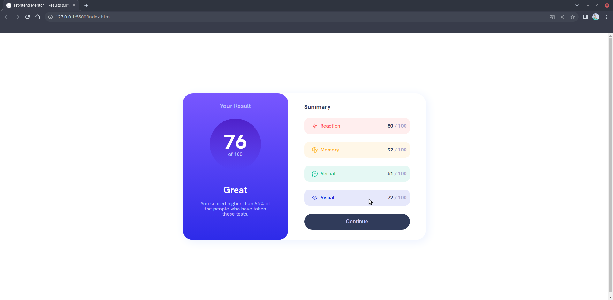

# Frontend Mentor - Results summary component solution

This is a solution to the [Results summary component challenge on Frontend Mentor](https://www.frontendmentor.io/challenges/results-summary-component-CE_K6s0maV). Frontend Mentor challenges help you improve your coding skills by building realistic projects.

## Table of contents

- [Frontend Mentor - Results summary component solution](#frontend-mentor---results-summary-component-solution)
  - [Table of contents](#table-of-contents)
  - [Overview](#overview)
    - [The challenge](#the-challenge)
    - [Screenshot](#screenshot)
    - [Links](#links)
  - [My process](#my-process)
    - [Built with](#built-with)
    - [What I learned](#what-i-learned)
    - [Continued development](#continued-development)
  - [Author](#author)
 

## Overview

### The challenge

Users should be able to:

- View the optimal layout for the interface depending on their device's screen size
- See hover and focus states for all interactive elements on the page

### Screenshot

Here is the desktop version of my code :

(Mobile coming soon)

### Links

[MDN](https://developer.mozilla.org/fr/)

## My process

### Built with

- Semantic HTML5 markup
- CSS custom properties
- Flexbox
  
### What I learned

This exercise helped me practice my HTML and CSS basic knowledge, I've learned to use color selectors with hsl and hsla to deal with opacity (I only knew to do so with rgb, rgba before that)

### Continued development

I want to keep practicing on layouts but mostly I want to start to include some JS into my code. (Guess I'll come back to that soon)

## Author

- Github - [Camille Sanchez](https://github.com/SanchezCamille)
- Frontend Mentor - [@SanchezCamille](https://www.frontendmentor.io/profile/SanchezCamille)
